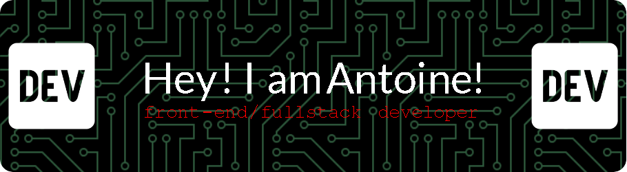

I'm  Antoine, newbie front-end/fullstack dev, currently at Ada tech School in Paris. 

My current favorite stacks are React and Tailwind on the front-end, and Python/Django for the back-end.

I'm currently studying at Ada Tech School, a 2-year program to become a full stack developer. Ada Tech School follows an alternative pedagogy emphasizing inclusivity and learning through hands-on experience, allowing me to deepen my expertise in front-end technologies while also cultivating my back-end skills.

I’m looking to collaborate on web and mobile app development projects. I'm particularly excited about opportunities that allow me to work on creative projects, driven by design, and continue to learn new languages, stacks, and best practices in Tech.

If you want to reach me ( or nerd about the latest update of the Steam Deck) : antoinerp@gmail.com !

Pronouns: he/him

I previously was a web editor at [Actugaming.net](http://actugaming.net/author/antoinerp "Actugaming.net") for 7 years, so SEO is not a secret for me.

I'm also a photographer & muscian. but for now, my next album is a complete secret ! 
