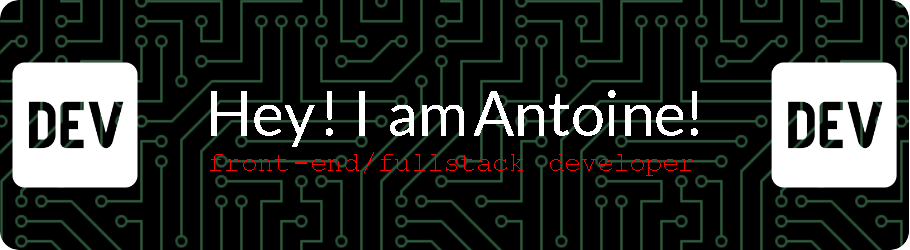

# Hi there 👋  
🎓 I'm Antoine, a **Fullstack & Mobile Developer**, currently working at **TKorp**.  

⌨️ My current stacks are:  
- **Next.js** and **Tailwind CSS** for the front-end  
- **NestJS** for the back-end  
- **React Native** (Expo) for mobile  

On the side, I'm developing small projects such as **web extensions for Twitch** and **mobile apps**.  

I’m looking to collaborate on **web and mobile development projects**.  
I'm particularly excited about opportunities that allow me to work on **creative, design-driven projects** and to keep learning **new languages, stacks, and best practices**.  

📫 Reach me at: **antoinerp@gmail.com** (or to nerd out about the latest Steam Deck update 🎮).  

Pronouns: **he/him**  

✒️ I previously worked as a **Web Editor at [Actugaming.net](http://actugaming.net/author/antoinerp)** for 7 years — SEO has no secrets for me.  

🎶 I’m also a **photographer & musician**. Recently, I released my first album under a new project:  
👉 [Disembarkment Syndrome – Behind the Smile](https://disembarkmentsyndrome.bandcamp.com/album/behind-the-smile)  

---

## 🌐 Social Media

---

## 💻 Tech Stacks

---

## 📚 Currently Learning
- Everything 🚀 (always exploring new stacks, frameworks & tools)

---

  

